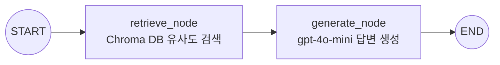

---
tags:
  - LangGraph
  - RAG
  - AI
created: 2026-09-16
---

# 랭그래프(LangGraph) 작동방식 feat. 옵시디언

> [!summary] 한 줄 요약
> LangGraph는 LLM 애플리케이션을 **"상태(State)를 공유하는 노드들의 그래프"**로 설계하는 프레임워크다. 이 Vault의 RAG 에이전트(`obsidian-rag/2_agent.py`)는 `검색(retrieve) → 생성(generate)` 2개 노드로 구성된 가장 단순한 형태의 그래프다.

## 1. LangGraph의 핵심 개념 3가지

### ① State (상태)
그래프 전체를 관통하며 흐르는 **공유 데이터 구조**. 각 노드는 상태를 읽고, 자기가 갱신할 부분만 반환한다.

```python
class RAGState(TypedDict):
    question: str        # 사용자의 질문
    context: list[Document]  # 검색된 옵시디언 노트 청크들
    answer: str          # 최종 답변
```

- 노드가 상태 **전체를 덮어쓰지 않고**, 반환한 키만 병합(merge)된다.
- 예: `retrieve_node`가 `{"context": docs}`만 반환하면 `question`은 그대로 유지된다.

### ② Node (노드)
상태를 입력받아 일부를 갱신해 반환하는 **순수 Python 함수**. LLM 호출, DB 검색, 도구 실행 등 무엇이든 될 수 있다.

### ③ Edge (엣지)
노드 간의 **실행 순서**를 정의한다. 고정 엣지(`add_edge`)와 조건부 엣지(`add_conditional_edges`)가 있으며, 조건부 엣지를 쓰면 분기·루프가 가능해진다.

## 2. 이 Vault의 RAG 에이전트 그래프



### 실행 흐름 (질문 1개가 처리되는 과정)

1. **입력**: `app.invoke({"question": "..."})` — 질문이 상태에 담겨 그래프에 진입
2. **retrieve_node**:
   - 질문을 `text-embedding-3-small`로 벡터화
   - Chroma DB에서 코사인 유사도 기준 상위 k=4개 청크 검색
   - `{"context": [검색된 청크들]}` 반환 → 상태에 병합
3. **generate_node**:
   - 검색된 청크들을 출처(파일 경로)와 함께 프롬프트의 `{context}`에 주입
   - `gpt-4o-mini`가 **문서 근거로만** 한국어 답변 생성 (없으면 "못 찾았다"고 답하도록 시스템 프롬프트로 제약)
   - `{"answer": 응답}` 반환
4. **출력**: END 도달 → 최종 상태에서 `answer`와 `context`(참조 문서)를 꺼내 출력

### 코드 골격

```python
graph = StateGraph(RAGState)
graph.add_node("retrieve", retrieve_node)
graph.add_node("generate", generate_node)
graph.add_edge(START, "retrieve")
graph.add_edge("retrieve", "generate")
graph.add_edge("generate", END)
app = graph.compile()   # 실행 가능한 Runnable로 컴파일
```

## 3. 왜 단순 체인(Chain)이 아니라 그래프인가?

현재는 직선 구조라 LCEL 체인(`retriever | prompt | llm`)과 차이가 없어 보이지만, LangGraph는 **확장 지점**이 명확하다:

| 확장 아이디어 | 방법 |
|---|---|
| 검색 결과가 부실하면 질문 재작성 후 재검색 | `generate` 앞에 평가 노드 + 조건부 엣지로 루프 |
| 답변 품질 자가 검증 (Self-RAG) | `generate` 뒤에 검증 노드, 실패 시 `retrieve`로 회귀 |
| 대화 이력 기억 | `checkpointer`(메모리/DB) 장착 |
| 여러 Vault/도구 라우팅 | START 직후 라우터 노드로 분기 |

즉, **분기·루프·영속 상태**가 필요해지는 순간부터 그래프 구조가 진가를 발휘한다.

## 4. 옵시디언과의 접점

- 옵시디언 노트는 그 자체가 **링크로 연결된 지식 그래프**이고, LangGraph는 **처리 로직의 그래프**다. 전자는 데이터, 후자는 실행 흐름을 그래프로 표현한다.
- 노트의 `[[위키링크]]` 구조는 인덱싱 시 전처리로 순수 텍스트화되지만, 향후 링크 관계를 메타데이터로 보존하면 **그래프 기반 검색(GraphRAG)** 노드로 확장할 수 있다.
- 전체 데이터 흐름과 인프라는 [[지식베이스 아키텍처 구조]] 참고.
