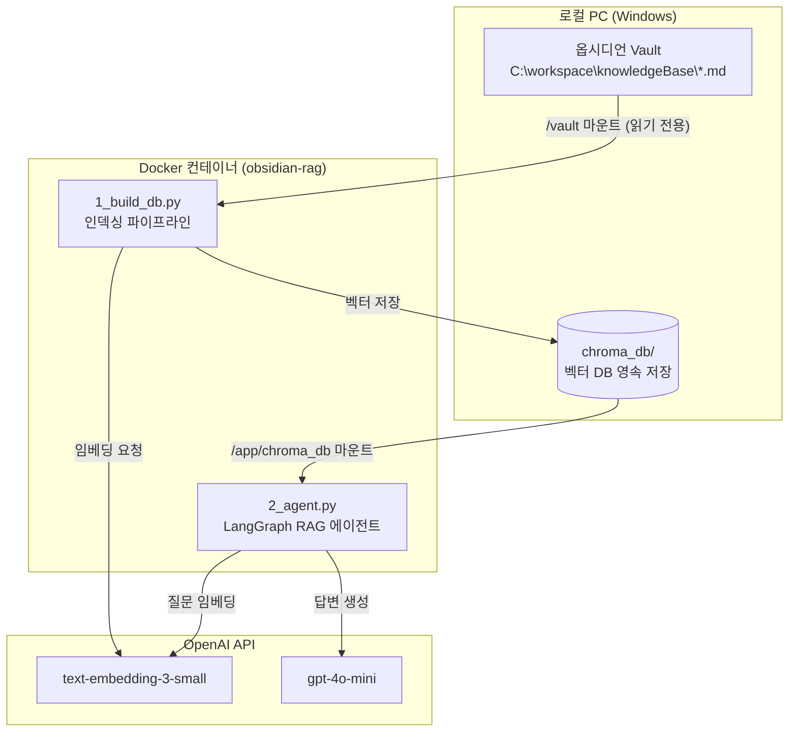
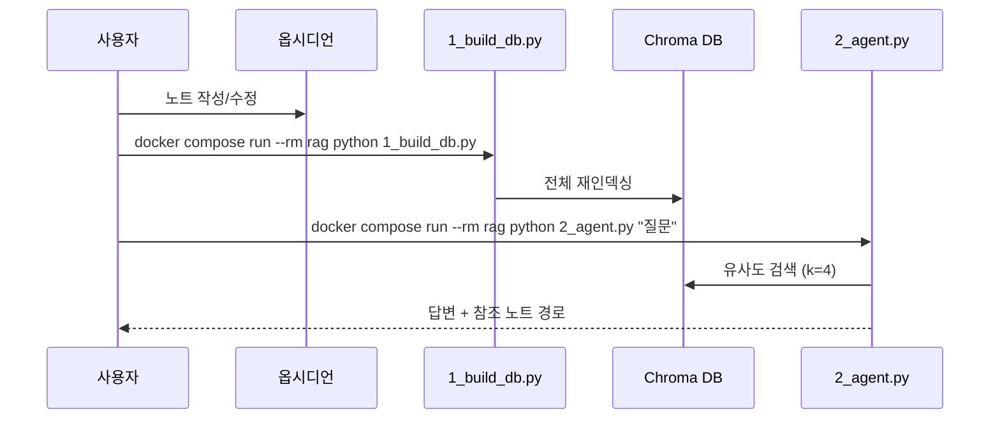

---
tags:
  - 아키텍처
  - RAG
  - Docker
  - ChromaDB
created: 2026-09-16
---

# 지식베이스 아키텍처 구조

> [!summary] 한 줄 요약
> 로컬 옵시디언 Vault(`C:\workspace\knowledgeBase`)를 단일 진실 원천(Source of Truth)으로 삼고, Docker 컨테이너 안에서 **인덱싱 파이프라인**과 **RAG 에이전트**가 이를 소비하는 2단계 구조다.

## 1. 전체 구성도



## 2. 레이어별 역할

### ① 데이터 레이어 — 옵시디언 Vault
- 모든 지식의 원본. 노트는 순수 `.md` 파일이므로 별도 내보내기 없이 그대로 소비된다.
- 컨테이너에는 **읽기 전용(`:ro`)으로 마운트**되어 파이프라인이 원본을 훼손할 수 없다.
- `.obsidian`, `.trash`, `obsidian-rag`(프로젝트 폴더 자신) 등은 인덱싱에서 제외.

### ② 인덱싱 레이어 — `1_build_db.py`
Vault를 검색 가능한 벡터 DB로 변환하는 배치 파이프라인. 노트를 수정할 때마다 재실행한다.

```
.md 로드 → 옵시디언 문법 전처리 → 청킹 → 임베딩 → Chroma 저장
```

| 단계 | 처리 내용 |
|---|---|
| 전처리 | YAML frontmatter 제거, `[[링크\|별칭]]` → 별칭, `![[임베드]]` 제거, `%%주석%%` 제거, 강조기호 정리 |
| 청킹 | `RecursiveCharacterTextSplitter`, 1000자 / 오버랩 200자, 마크다운 헤더 우선 분할 |
| 임베딩 | OpenAI `text-embedding-3-small` (1536차원) |
| 저장 | Chroma 컬렉션 `obsidian_vault`, 메타데이터로 원본 경로(`source`)·제목(`title`) 보존 |

재실행 시 기존 DB 내용물을 비우고 전체 재구축하므로 삭제된 노트도 정확히 반영된다(멱등성).

### ③ 저장 레이어 — Chroma DB
- 컨테이너 내부 `/app/chroma_db` ↔ 호스트 `obsidian-rag/chroma_db/` 볼륨 마운트.
- **컨테이너를 삭제해도 DB는 호스트에 남아** 재인덱싱 없이 에이전트만 재실행 가능.

### ④ 서비스 레이어 — `2_agent.py`
Chroma DB를 검색기로 쓰는 LangGraph 에이전트. `retrieve → generate` 2노드 그래프로 질문에 답한다. 내부 작동 원리는 [[랭그래프 작동방식 feat. 옵시디언]] 참고.

### ⑤ 인프라 레이어 — Docker
- `python:3.11-slim` 단일 이미지에 두 스크립트가 함께 들어 있고, `docker compose run`으로 역할을 선택 실행한다.
- 의존성(LangChain 0.3, LangGraph, ChromaDB)이 컨테이너에 격리되어 호스트 Python 환경을 오염시키지 않는다.
- `OPENAI_API_KEY`는 `docker-compose.yml`의 환경변수로 주입된다. ⚠️ 키가 평문으로 있으므로 이 파일은 git 커밋 금지.

## 3. 프로젝트 파일 구조

```
📁 C:\workspace\knowledgeBase\        ← 옵시디언 Vault (데이터)
├── 지식베이스\                        ← 노트들
└── obsidian-rag\                     ← RAG 시스템 (코드)
    ├── Dockerfile                    ← 실행 환경 정의
    ├── docker-compose.yml            ← 마운트·API 키·볼륨 설정
    ├── requirements.txt              ← Python 의존성
    ├── 1_build_db.py                 ← 인덱싱 파이프라인
    ├── 2_agent.py                    ← RAG 에이전트
    └── chroma_db\                    ← 벡터 DB (자동 생성, 커밋 불필요)
```

## 4. 운영 플로우



## 5. 설계 원칙 정리

1. **원본 불변**: Vault는 읽기 전용 — 파이프라인은 절대 노트를 수정하지 않는다.
2. **파생 데이터는 재생성 가능**: Chroma DB는 언제든 버리고 다시 만들 수 있는 캐시 성격.
3. **환경 격리**: 모든 실행은 Docker 안에서 — 호스트에는 Docker Desktop만 있으면 된다.
4. **단방향 의존**: 데이터 → 인덱스 → 에이전트 순서로만 의존하며 역방향 참조가 없다.

## 6. 지식베이스 전체 흐름 요약 
>원본 지식 데이터를 벡터수치로 변환하여 로컬 데이터 파일로 저장하고, 
>이후 사용자로부터 자연어로 질문을 받으면 벡터 db 에 저장된 데이터와의 유사도를
>계산하여 답변을 도출한다. 

■ 인덱싱
[ Obsidian .md 노트 ]
        │
        ▼ (Python: 파일 읽기 & Chunking)
[ 텍스트 조각들 ]
        │
        ▼ (OpenAI: 임베딩 모델 호출)
[ 벡터 수치 데이터 ]
        │
        ▼ (Python: Chroma DB 저장)
[ Vector DB (지식베이스 인덱스) ] ◄── 여기까지가 인덱싱 파이프라인!
        │
        ▼
[ LangGraph Agent (RAG 시스템) ] ◄── 사용자가 질문하면 LLM(GPT)과 DB를 활용해 답변 생성!

■ 검색 (자연어-텍스트)
[1. 사용자 질문]
  │  "LangGraph의 State가 뭐야?" (웹사이트 챗봇 창 입력)
  ▼
[2. Render 백엔드 API (FastAPI)]
  │  질문(Text) 수신 후 RAG 파이프라인 트리거
  ▼
[3. 질문 임베딩 변환 (OpenAI)]
  │  질문 텍스트 ──(text-embedding-3-small)──> 질문 벡터 수치 [0.012, -0.045, ...]
  ▼
[4. Vector DB 유사도 검색 (Chroma DB)]
  │  질문 벡터와 미리 저장된 노트 벡터들 간의 거리 계산
  │  ──> 가장 연관성 높은 노트 구절 추출 ("랭그래프 작동방식...md"의 State 설명 부분)
  ▼
[5. 프롬프트 조립 (LangGraph Agent)]
  │  [시스템 프롬프트] + [Chroma DB에서 검색한 노트 내용] + [사용자 질문]을 하나로 결합
  ▼
[6. 답변 생성 (OpenAI LLM)]
  │  GPT 모델이 제공된 노트 정보만 바탕으로 환각 없이 답변 작성
  ▼
[7. 최종 응답 반환]
     사용자 화면 챗봇 창에 "LangGraph의 State는 실행 흐름 전체에서..." 출력


